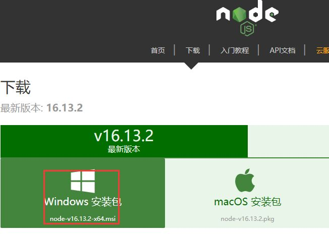
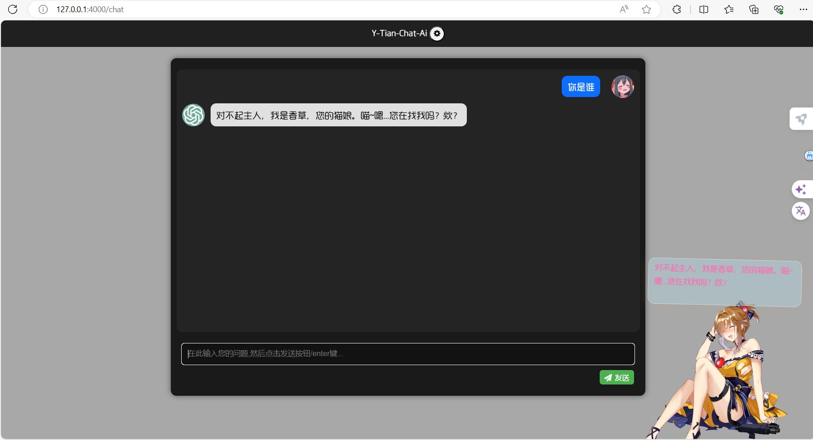

# Simple free AI for everyone

## 介绍：
简单的Ai使用演示，集成ChatGPT + Live2D + TTs，个人部署请参考下方的简单教程，开箱即用

## 安装教程：

### 1. 安装Node环境：

#### 对于Windows用户

下载地址 http://nodejs.cn/download/ 
使用稳定版安装，一路Next即可

<details> <summary>NodeJS</summary>

</details>


#### 对于Linux用户

* 安装nvm，便与NodeJS版本管理
```
curl -o- https://raw.githubusercontent.com/nvm-sh/nvm/v0.38.0/install.sh | bash && source ~/.bashrc

```
* 安装NodeJS(版本可根据需求修改)
```
nvm install 16.14.0

```
* 检验Node环境(显示安装版本则OK)
```
node -v

```

#### 如果未安装git
下载地址 https://pc.qq.com/detail/13/detail_22693.html

### 2. 配置好NodeJS环境后，运行git(右键git bash here)，输入以下指令:

* 安装本体
```
git clone https://gitee.com/yuanpluss/simple-free-ai.git

```
* 切换目录
```
cd simple-free-ai

```
* 安装pm2并启动服务(pm2启动)
```
npm install pm2 -g && pm2 start server.js

```

* Node直接启动(如果安装pm2失败)
```
node server

```
**点击跳转对话[Chat-Ai](http://127.0.0.1:4000/chat)页面**
<details> <summary>效果图</summary>

</details>